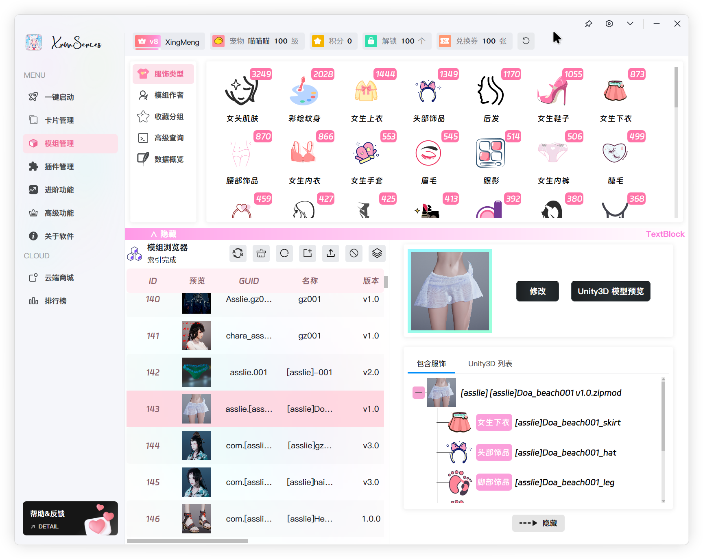

 
 

&nbsp;&nbsp;&nbsp;&nbsp;
&nbsp;&nbsp;&nbsp;&nbsp;
&nbsp;&nbsp;&nbsp;&nbsp;
&nbsp;&nbsp;&nbsp;&nbsp;

XrmSeries 3 是一款适用于 ILLUSION 旗下 HoneySlect2 DX 的综合管理工具。目前已经发布到第三代（每代版本都从0开始编写，在性能、界面以及底层逻辑上完全不同）本软件除了基础的启动器功能类外，额外扩展了卡片管理、模组管理、插件管理等资源管理类功能，以及进阶、高级等个性化类功能。为每一位玩家和创作者，搭建通向无限可能的桥梁。XrmSeries 的大部分功能都来自于用户社区提出的想法和建议，如果可能，将会在数日内开发完毕并推送更新。XrmSeries 可能会在趋近稳定后逐步支持 Koikatsu 以及 AI Shoujo。

